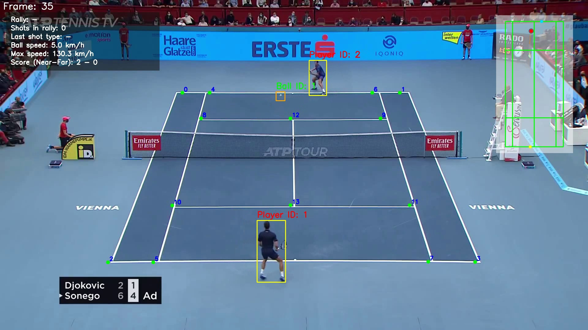
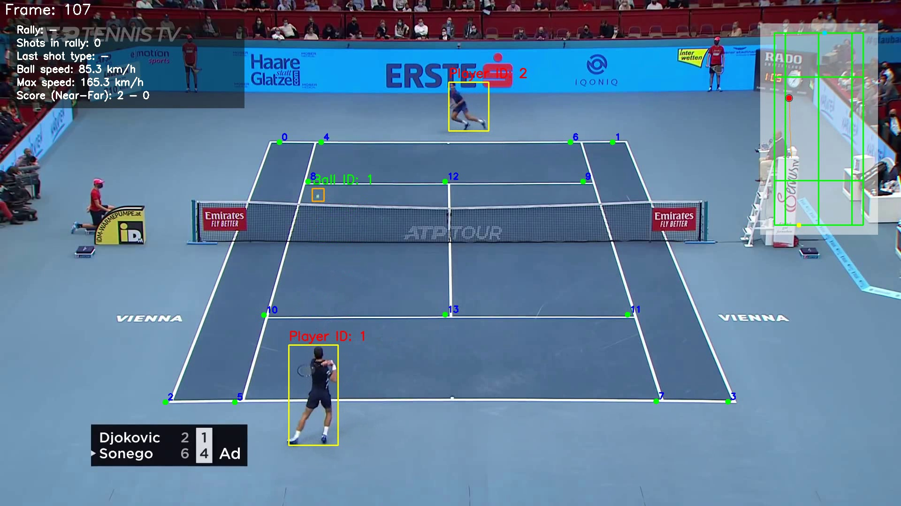
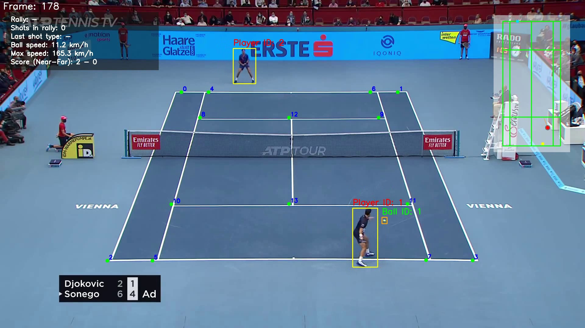

# Tennis ML Project

End-to-end tennis video analytics pipeline that detects players, tracks the ball, maps movement to a mini-court, and exports rally-level insights.

## What This Project Does
- Tracks players with YOLO-based player detection/tracking.
- Detects and interpolates ball positions frame-by-frame.
- Detects court keypoints with a ResNet-based model.
- Projects players and ball onto a stabilized mini-court overlay.
- Adds analytics overlays:
  - Shot-type inference (`serve`, `forehand`, `backhand`)
  - Ball speed estimation (`km/h`)
  - Rally stats panel
  - Point-outcome inference
- Exports highlight clips from top rallies.
- Exports structured analytics files (`CSV` + `JSON`).

## Demo Screenshots
### Analytics Overlay + Mini-Court


### Rally / Shot / Speed Visuals


### Output View During Play


## Project Structure
- `main.py`: Main pipeline entrypoint.
- `Trackers/`: Player and ball trackers.
- `Court_Line_Detector/`: Court keypoint model inference.
- `Mini_court/`: Mini-court rendering and projection logic.
- `utils/analytics.py`: Rally analysis, stats overlay, highlights, exports.
- `utils/video_utils.py`: Video IO helpers.
- `Models/`: Model artifacts (`.pt`, `.pth`).
- `Input_Videos/`: Input videos (not tracked in git).
- `Output_Videos/`: Generated outputs (not tracked in git).

## Setup
```powershell
python -m venv .venv
.\.venv\Scripts\activate
python -m pip install --upgrade pip
pip install -r requirements.txt
pip install torch==2.3.0 torchvision==0.18.0
pip install "numpy<2" "opencv-python<4.12"
```

## Demo: Run the Full Analytics Pipeline
```powershell
python main.py --use-stubs --input-video Input_Videos/input_video.mp4 --output-video Output_Videos/output_video_analytics.mp4 --events-csv Output_Videos/analysis_events.csv --summary-json Output_Videos/analysis_summary.json --highlights-dir Output_Videos/highlights
```

## Output Artifacts
Running the demo command generates:
- `Output_Videos/output_video_analytics.mp4`
- `Output_Videos/analysis_events.csv`
- `Output_Videos/analysis_summary.json`
- `Output_Videos/highlights/` (top rally clips)

## Useful Flags
- `--use-stubs`: Use cached tracker outputs for faster runs.
- `--disable-highlights`: Skip highlight generation.
- `--disable-analytics-overlay`: Keep core detections without analytics panel.
- `--fps`: Override FPS used in analytics calculations.

## Notes
- Large assets (models, raw videos, generated outputs) are intentionally excluded from git.
- This project is optimized for practical analysis workflows and iterative tuning.
- An implementation and extension of Code in a Jiffy's youtube video on Tennis Analysis. https://youtu.be/L23oIHZE14w?si=lqgqniwhEIZnzZN-
